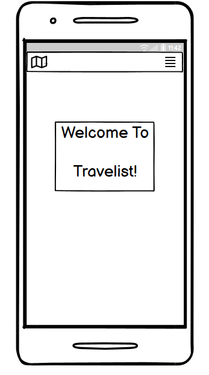
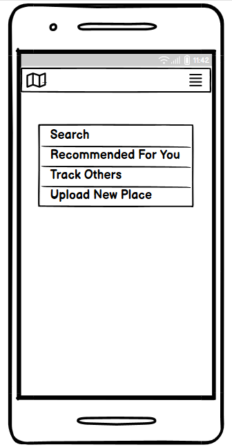
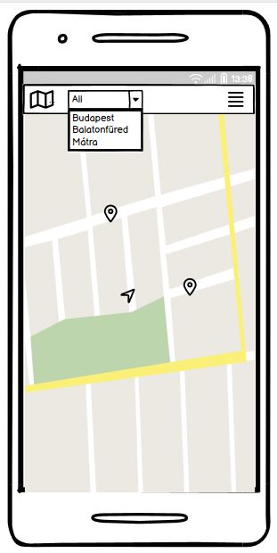
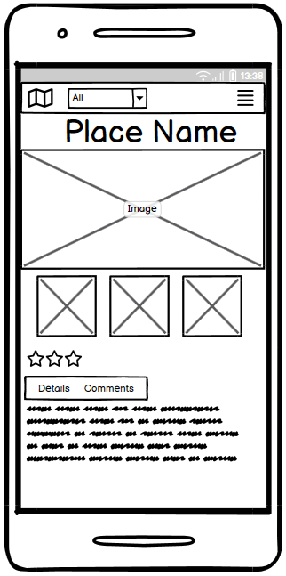
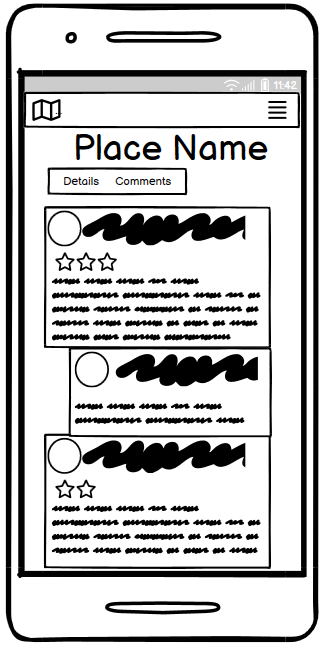
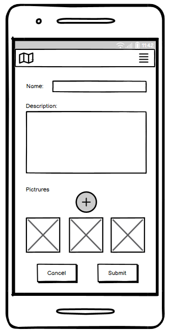

# Travelist – Turista Applikáció

A Travelist egy turista applikáció, melyet az új helyet felfedezni vágyók használhatnak új helyek, útvonalak megtekintésére, más emberek véleményének megismerésére. A felhasználók meg tudják osztani a saját tapasztalataikat is egy adott helyről, képek és szöveges üzenetek formájában is.

Ezen felül az applikációban lehetőség van valós idejű nyomonkövetésre és segítségkérésre is. A hely alapú reklámok segítik majd a felhasználókat, hogy a hozzájuk közel eső helyek közül könnyebben válasszanak úticélt. 

## Mobil applikáció
A mobil applikáció a következő kezdőképernyővel üdvözli a felhasználót:

Ha a felhasználó megnyomja a jobb felső sarokban lévő gombot, megjelenik egy menü, amely felkínálja az appban elvégezhető műveletek lehetőségeit. A menü a következőképp néz ki:

Ha a felhasználó a Search opciót választja, kereshet a helyek között. Megjelenik egy térkép, majd a ComboBox-ból kiválasztva a megtekinteni kívánt hely nevét, a térképen megjelölve megjelenik a hely, amelyre aztán rákattintva több információt kaphatunk.

Ha a felhasználó rákattint egy helyre, amiről több információt szeretne kapni, a következő képernyővel találja szemben magát:

Itt megtekintheti az adott helyről készült képeket, mások értékelését és véleményét. Ha rákattint a Details, Comments gombra, akkor elolvashatja ezeket a megjegyzéseket, részleteket: 

Ha a felhasználó a menüből az Upload New Place opciót választja megjelenik a következő képernyő:

Itt fel lehet tölteni egy helyről képet és szöveges értékelést, véleményt. 

A felhasználónak minden esetben lehetősége van visszatérni a főképernyőre, megnyomva a bal felső sarokban lévő térkép gombot, valamint a menüre, megnyomva a jobb felső sarokban lévő gombot. 
