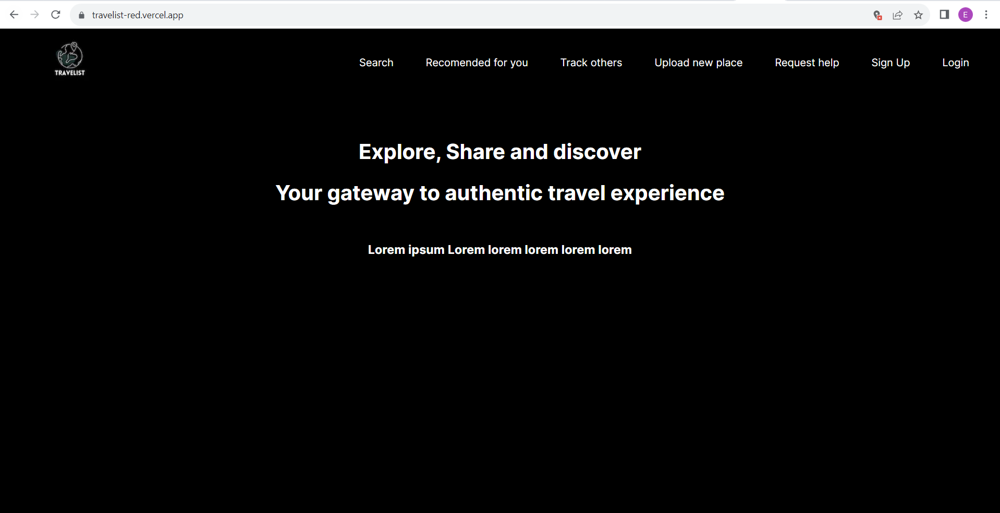
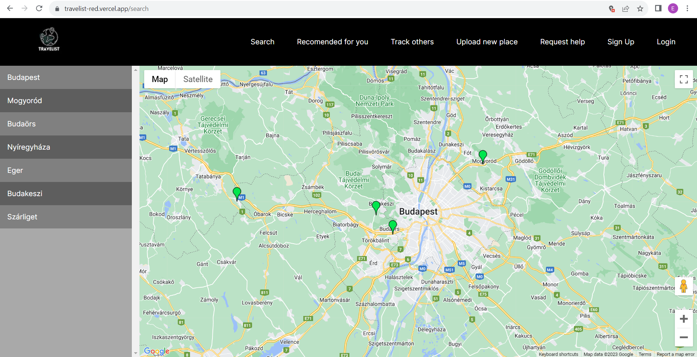
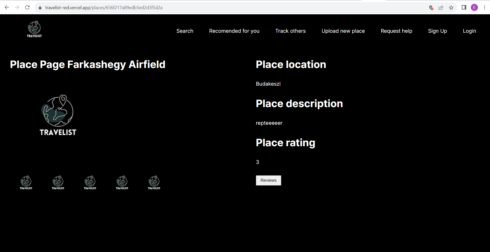
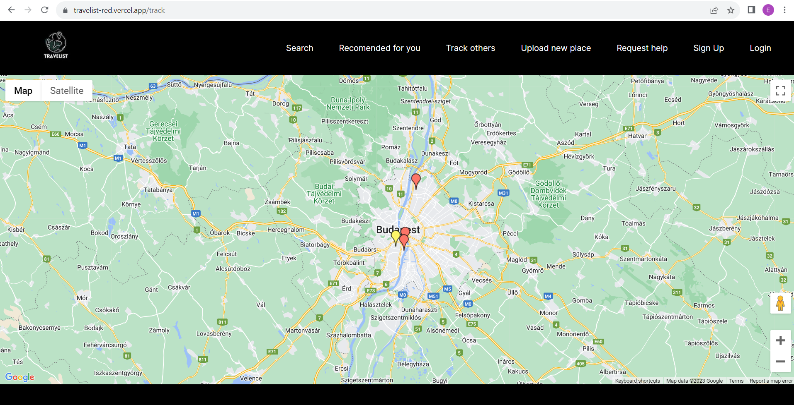
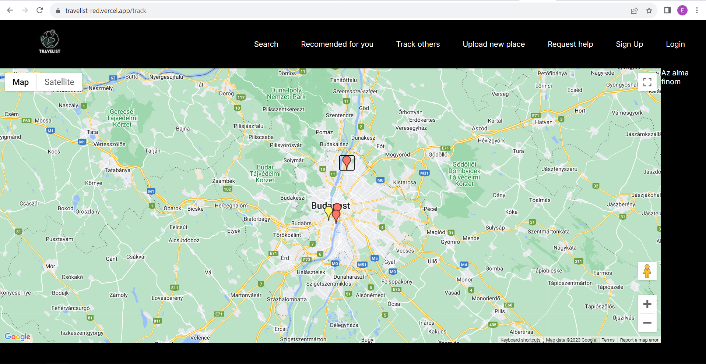
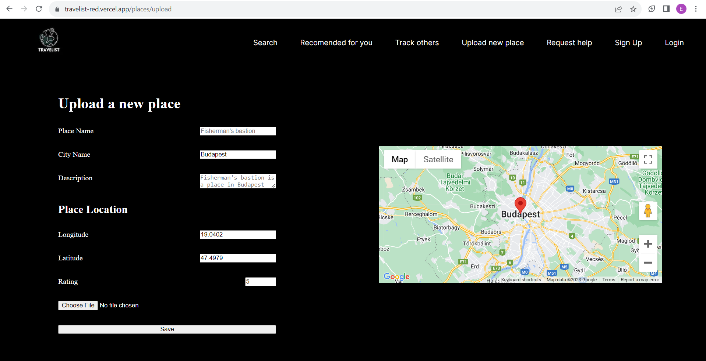
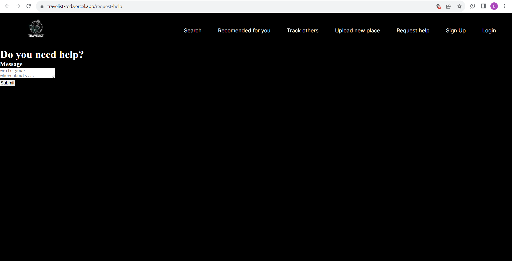
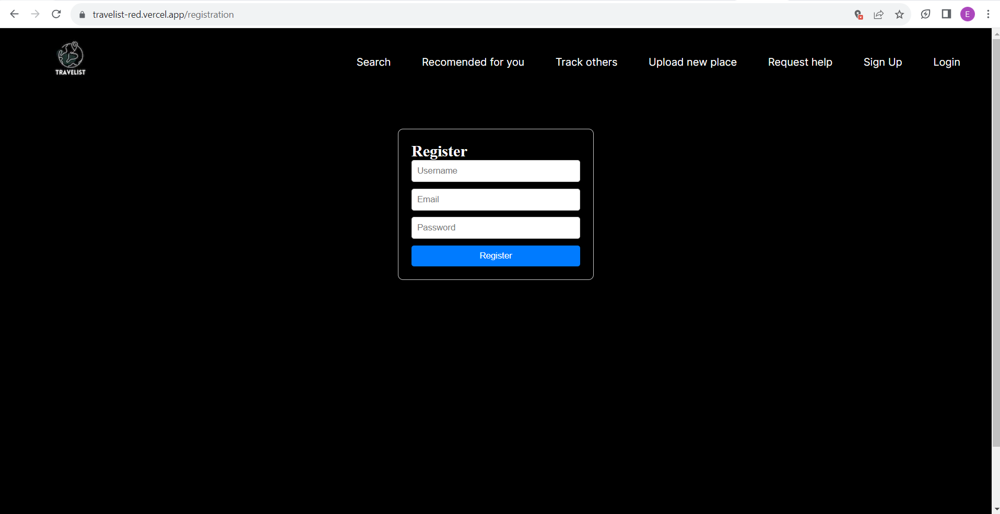
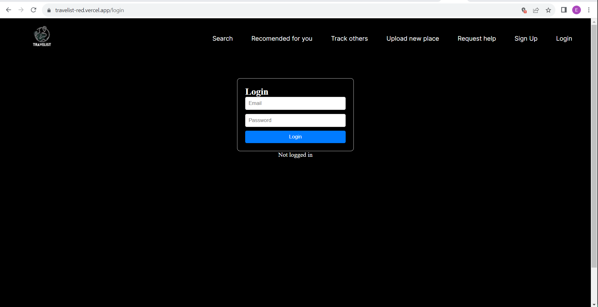

# Travelist – Turista Applikáció

A Travelist egy turista applikáció és weboldal, melyet az új helyet felfedezni vágyók használhatnak új helyek, más emberek véleményének megismerésére. A felhasználók meg tudják osztani a saját tapasztalataikat is egy adott helyről, képek és szöveges leírások formájában is.

Ezen felül az applikációban lehetőség van valós idejű nyomonkövetésre és segítségkérésre is. A hely alapú ajánlások segítik majd a felhasználókat, hogy a hozzájuk közel eső helyszínek közül könnyebben válasszanak úticélt.  

## Webes felület

A weboldal a következő kezdőképernyővel indul:

Az oldal tetején megjelennek az elvégezhető műveletek: Search, Recommended for you, Track Others, Upload new place, Request help, Sign Up, Login.

Ha a Search-re kattintunk, megjelennek az eddig feltöltött helyek. A képernyő bal oldalán található egy lista, itt ki tudjuk választani, hogy melyik városból szeretnénk megtekinteni a helyeket.

Ha valamelyik helyről részletesebb információkat szeretnénk kapni, csak rá kell kattintatunk a térképen, aminek hatására a következő oldalra navigálunk:

Itt megjelennek képek, részletek, értékelések az adott helyről. Ha mások véleményére vagyunk kíváncsiak, a Reviews gombra kattintva elolvashatjuk azokat.

Ha a felhasználó a fenti menüsávból a Recommended for you opciót választja, megjelennek előtte a közelében lévő helyek: 

Ha a Track others opciót választjuk, megjelenik egy térkép, rajta megjelölve a közelben lévő felhasználókkal. A felhasználóknak van lehetősége segítséget kérni, ezek pirossal jelennek meg a térképen, azok akik nem kértek segítséget pedig sárgával. Ha valamelyik piros markerre ráklikkelünk, akkor a képernyő jobb oldalán megjelenik a felhasználó által beírt segítségkérő üzenet.

Ha az Upload new place opciót választjuk, meg tudunk osztani egy új helyről képeket, valamint a véleményünket és értékelésünket. Be kell írnunk az adott hely nevét, hogy melyik városban található, egy szöveges leírást, és egy értékelést. Térképről ki tudjuk választani, hogy hol található az adott hely. Ennek koordinátáit kijelölés után automatikusan kitölti a rendszer.

A fenti menüsávból a Request help opciót választva segítséget tudunk kérni a többi felhasználóktól. Egy szöveges üzenetet kell beírnunk ehhez.

A menüsáv végén lévő Sign Up-ra kattintva regisztrálni tudunk. Meg kell adnunk egy email-címet, fehasználónevet és jelszót.

A Login-ra kattintva pedig be tudunk jelentkezni a fiókunkba:

