# Travelist – Turista Applikáció

A Travelist egy turista applikáció, melyet az új helyet felfedezni vágyók használhatnak új helyek, útvonalak megtekintésére, más emberek véleményének megismerésére. A felhasználók meg tudják osztani a saját tapasztalataikat is egy adott helyről, képek és szöveges üzenetek formájában is.

Ezen felül az applikációban lehetőség van valós idejű nyomonkövetésre és segítségkérésre is. A hely alapú reklámok segítik majd a felhasználókat, hogy a hozzájuk közel eső helyek közül könnyebben válasszanak úticélt. 

## Mobil applikáció
A mobil applikáció elindítása után a felhasználónak regisztrálnia kell, vagy ha már van fiókja, be kell jelentkeznie. Ha ezt nem teszi meg, figyelmeztetést kap, hogy csak így tud hozzáférni az applikáció többi funkciójához.

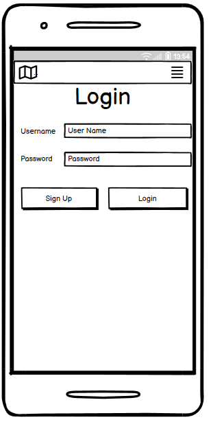
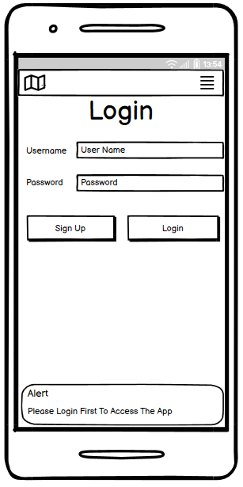

Ezután a mobil applikáció a következő kezdőképernyővel üdvözli a felhasználót:

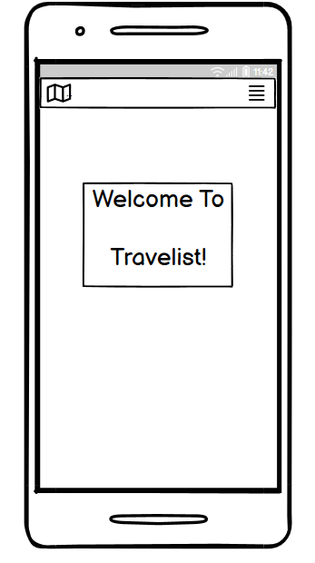

Ha a felhasználó megnyomja a jobb felső sarokban lévő gombot, megjelenik egy menü, amely felkínálja az appban elvégezhető műveletek lehetőségeit. A menü a következőképp néz ki:

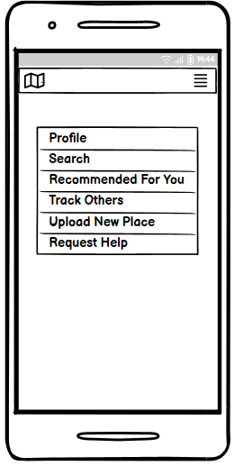

Ha a Profile opciót választjuk, meg tudjuk tekinteni a profilunkat:

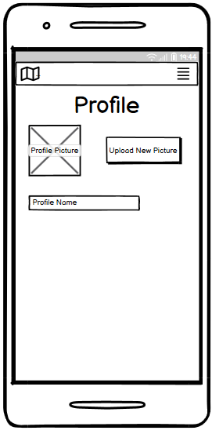

Ha a felhasználó a Search opciót választja, kereshet a helyek között. Megjelenik egy térkép, majd a ComboBox-ból kiválasztva a megtekinteni kívánt hely nevét, a térképen megjelölve megjelenik a hely, amelyre aztán rákattintva több információt kaphatunk.

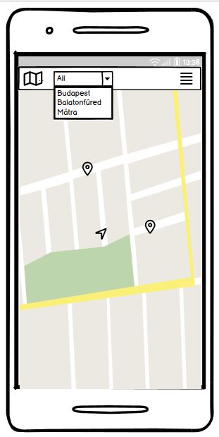

Ha a felhasználó rákattint egy helyre, amiről több információt szeretne kapni, a következő képernyővel találja szemben magát: 

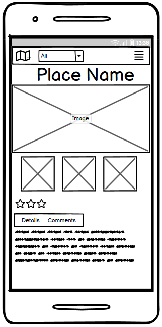

Itt megtekintheti az adott helyről készült képeket, mások értékelését és véleményét. Ha rákattint a Details, Comments gombra, akkor elolvashatja ezeket a megjegyzéseket, részleteket: 

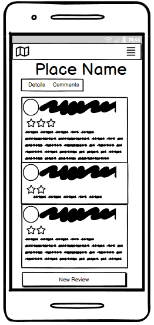

Itt a felhasználó hozzá tud adni új értékelést az adott helyhez, ehhez a képernyő alján lévő New Review gombra kell kattintania. Ekkor a következő oldalra navigál az applikáció:

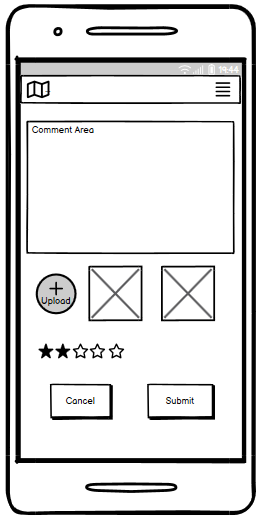

Itt szöveges véleményt tud írni, valamit képeket tud feltölteni az adott helyről. A Submit gomb megnyomása után megjelenik az értékelés a többi felhasználó már meglévő véleménye alatt.

Ha a felhasználó a menüből a Recommended For You opciót választja, felsorolás szerűen megjelennek a hozzá közel eső helyek, azok értékelései és képei:

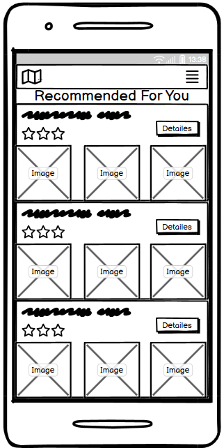

Itt a Details gombra kattintva ugyancsak arra az oldalra kerülünk, amelyiken megtekinthetjük az adott helyről készült képeket, mások értékeléseit és kommentjeit.

Ha a menüből a Track Others opciót választjuk, egy térképen láthatjuk a hozzánk közel lévő felhasználókat:

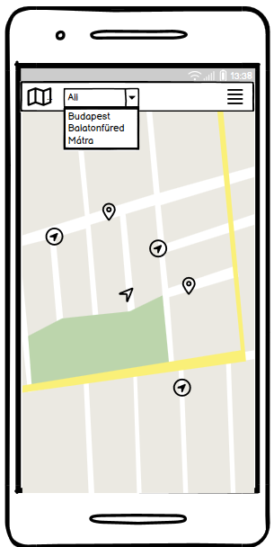

Ha a felhasználó a menüből az Upload New Place opciót választja megjelenik a következő képernyő:

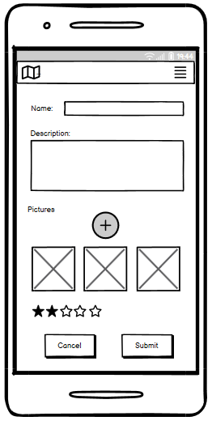

Itt fel lehet tölteni egy helyről képet és szöveges értékelést, véleményt. 

A menüből a Request Help opciót választva a felhasználónak lehetősége van segítséget kérni a közelben lévő többi felhasználótól, ehhez csak a képernyő közepén lévő nagy gombot kell megnyomnia:

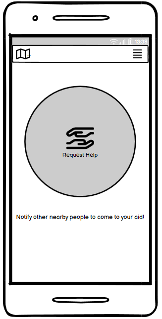

Ha valaki a közelünkben segítséget kért, akkor kapunk erről egy értesítést, valamint ez a térképen következőképpen jelenik meg:

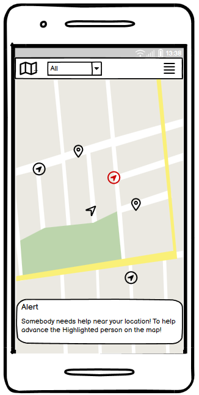

A felhasználónak minden esetben lehetősége van visszatérni a főképernyőre, megnyomva a bal felső sarokban lévő térkép gombot, valamint a menüre, megnyomva a jobb felső sarokban lévő gombot. 

## Webes felület

A weboldal a következő kezdőképernyővel indul:

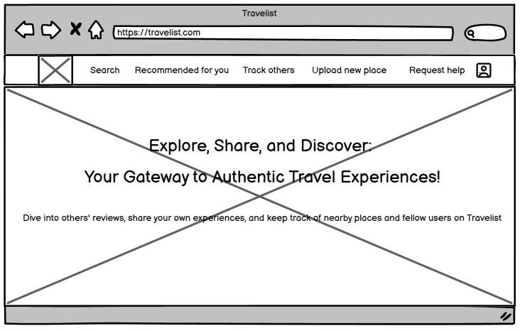

Az oldal tetején megjelennek ugyanazok az opciók, mint amik a mobil applikáció menüjében. 

Ha a Search-re kattintunk, keresni tudunk a helyek között a bal oldalon található lista segítségével. Ha valamelyik listaelemre rákattintunk, az adott hely megjelenik a térképen. 

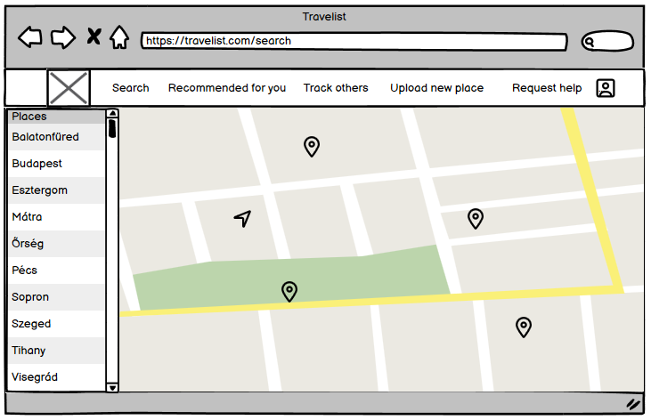

Ha valamelyik helyről részletesebb információkat szeretnénk kapni, csak rá kell kattintatunk a térképen, aminek hatására a következő oldalra navigálunk:

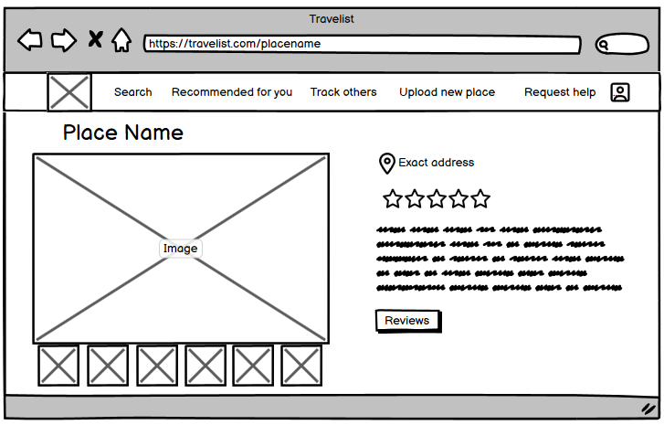

Itt megjelennek képek, részletek, értékelések az adott helyről. Ha mások véleményére vagyunk kíváncsiak, a Reviews gombra kattintva elolvashatjuk azokat. Ez a következőképpen néz ki:

Ha új értékelést szeretnénk írni az adott helyhez, a New Review gombra kattintva megtehetjük ezt, aminek hatására a következő oldalon találjuk magunkat:

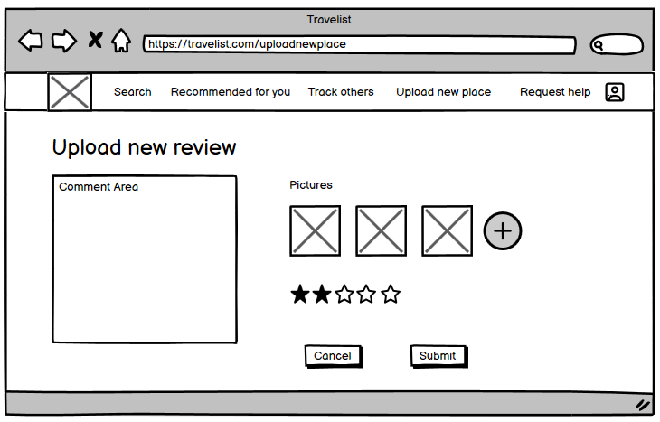

Itt szöveges értékelést tudunk írni, képeket feltölteni, értékelni a helyet. A Cancel és a Submit gombokra kattintva a már meglévő értékelésekhez navigálunk. 

Ha a felhasználó a fenti menüsávból a Recommended for you opciót választja, megjelennek előtte a közelében lévő helyek (az adott hely neve, értékelése és egy kép róla): 

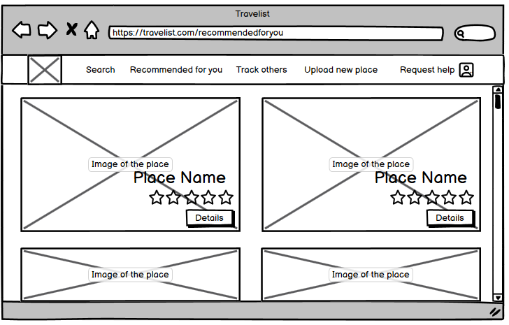

Ha valamelyik helyről részletesebb információkat szeretne kapni, a Details gombra kell kattintania, ami a már bemutatott - képeket, részleteket, értékeléseket - tartalmazó oldalra navigál.

Ha a Track others opciót választjuk, megjelenik egy térkép, rajta megjelölve a közelben lévő felhasználókkal:

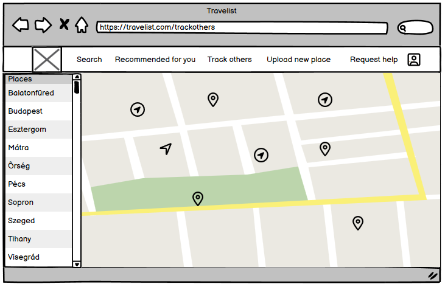

Ha az Upload new place opciót választjuk, meg tudunk osztani egy új helyről képeket, valamint a véleményünket és értékelésünket. 

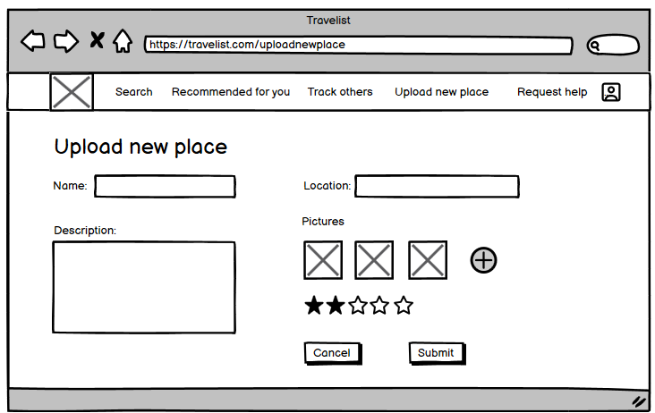

Itt a Cancel és a Submit gomb is visszavisz minket a főoldalra.

A fenti menüsávból a Request help opciót választva segítséget tudunk kérni a közelünkben lévő felhasználóktól. Ehhez, mint a mobil applikációban, a képernyő közepén lévő gombot kell csak megnyomni.

Ha valaki a közelünkben segítséget kér, értesítést kapunk, és a térképen látjuk a helyzetét:

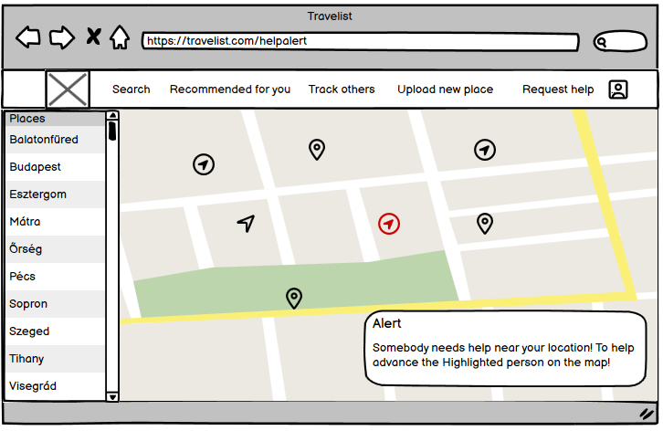

A menüsáv végén lévő profil gombra kattintva be tudunk jelentkezni a fiókunkba, vagy ha még nem regisztráltunk, akkor ezt is megtehetjük. 

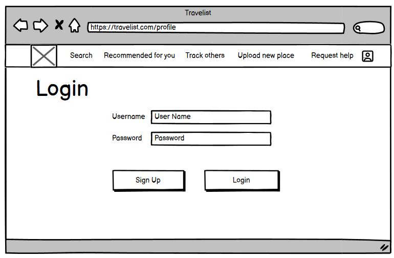

Ha már bejelentkeztünk, akkor a profil gombra kattintva az adatainkat tekinthetjük meg:

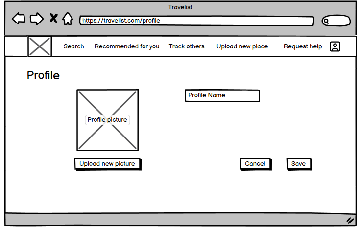

## Használt technológiák

### Web: 
* NextJS
* FireBase
* Github Actions
* Vercel
* NodeJS
* Tailwind
* Google Maps API

### Mobil:
* Kotlin
* Jetpack Compose
* Google Maps API